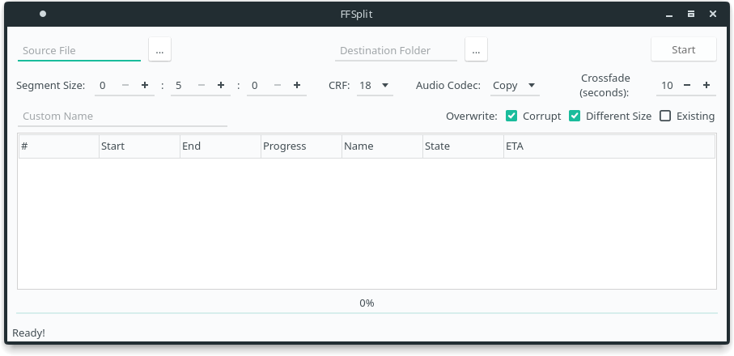

<!-- @format -->

# FFSplit

## Description

A simple gui video splitter in qt using ffmpeg.



### Features

- Split videos into segments
- Rencode segments
- Crossfade between segments
- Smart Pause/Resume
- Autodetection of old segments

## Dependencies

- FFMpeg
- Qt
- qmake (For compiling)

## Build

Compile

---

```sh
git clone https://gitlab.com/Antiquete/ffsplit
cd ffsplit
mkdir build && cd build
qmake ../FFSplit.pro
make
```

Run

---

```sh
./FFSplit
```
